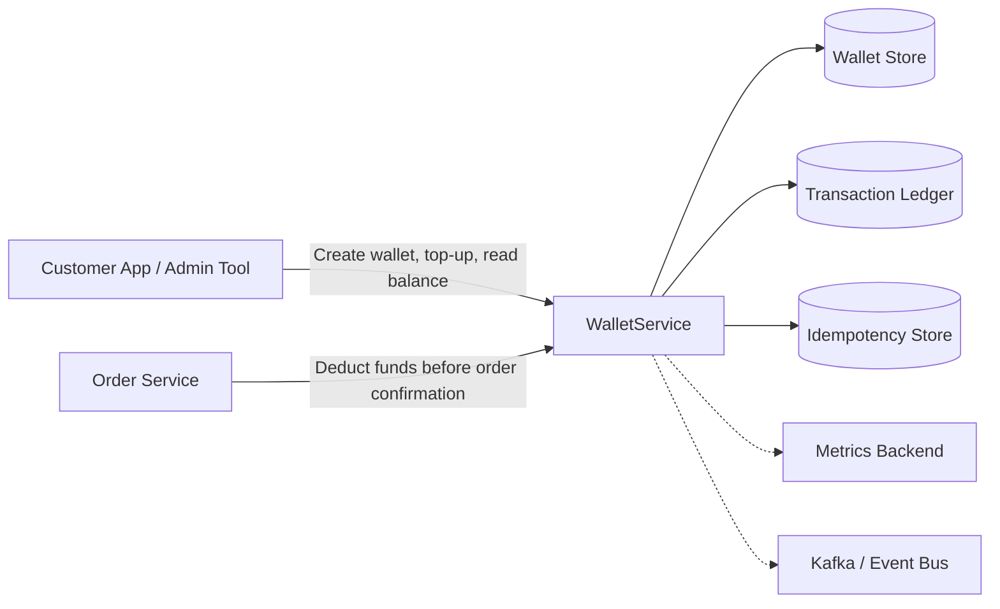
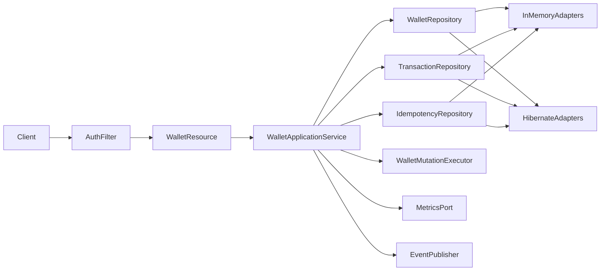
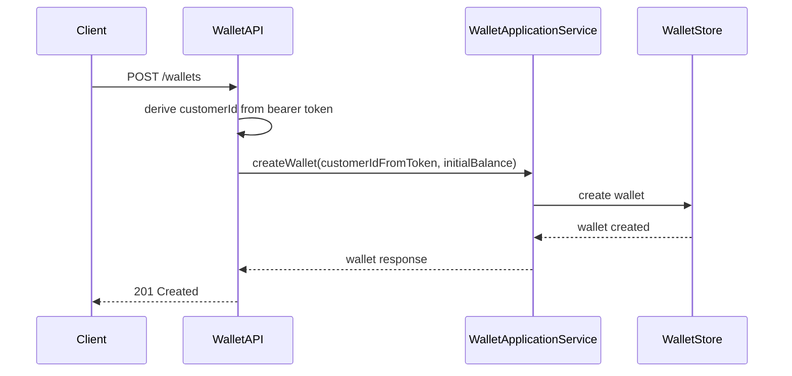
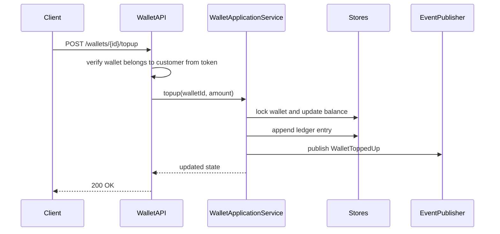
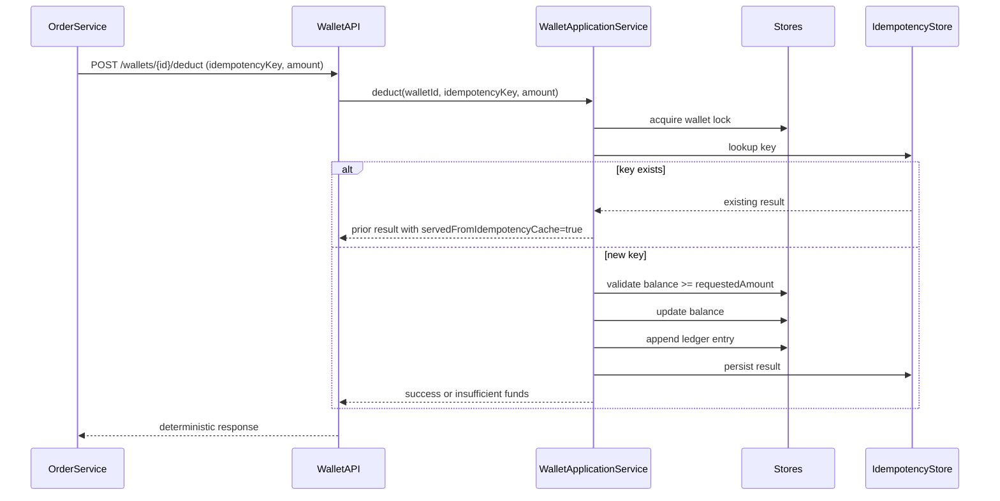

# Wallet Service High-Level Design

## 1. Objective
Build a wallet service that owns customer balances for a logistics platform and enforces a strict invariant:

- A wallet can never go negative.
- Every successful money movement is recorded in an immutable ledger.
- A `deduct` request from `Order Service` must be idempotent.

The current runtime runs in-memory, but the architecture is intentionally shaped so it can evolve to a transactional database without changing business logic.

## 2. Scope
In scope:
- Wallet creation
- Wallet top-up
- Order-value deduction requested by `Order Service`
- Balance lookup
- Transaction history lookup
- Basic authentication and authorization
- Metrics and event publishing extension points

Out of scope:
- Full IAM and tenant management
- Real Kafka integration
- External database deployment
- Pagination and search APIs
- Full distributed coordination across service replicas

## 3. System Context
The wallet service is called by frontend-facing clients for top-up and read operations, and by `Order Service` for order-time deductions.



In the current runtime, the three stores are backed by in-memory adapters. The design keeps them behind ports so they can later move to a relational database without changing API or business logic.

### 3.1 Service-to-Service Order Placement View
The most important cross-service interaction is `Order Service -> Wallet Service` during order placement.

```mermaid
flowchart LR
Customer[Customer] --> OrderAPI[Order Service API]
OrderAPI --> OrderService[Order Service]
OrderService -->|POST /wallets/{walletId}/deduct| WalletAPI[Wallet Service API]
WalletAPI --> WalletApp[Wallet Application Service]
WalletApp --> WalletState[(Wallet Balance)]
WalletApp --> Idem[(Idempotency Record)]
WalletApp --> Ledger[(Ledger Entry)]
WalletApp --> Decision{Deduct accepted?}
Decision -->|Yes| OrderService
Decision -->|No| OrderService
OrderService -->|Confirm or reject order| Customer
```

This interaction needs a deterministic wallet response because `Order Service` may retry on timeouts, transient failures, or uncertain delivery. The wallet service therefore combines idempotency and balance checks in the same mutation boundary.

## 4. Functional Requirements
Required APIs:
- `POST /wallets`
- `GET /wallets/{walletId}`
- `POST /wallets/{walletId}/topup`
- `POST /wallets/{walletId}/deduct`
- `GET /wallets/{walletId}/balance`
- `GET /wallets/{walletId}/transactions`

Business rules:
- `topup` increases balance by the requested positive amount.
- `deduct` uses the amount provided by the trusted `Order Service`.
- `deduct` succeeds only if balance is at least the requested amount.
- repeated `deduct` requests for the same `walletId + idempotencyKey` must return the same logical result.
- repeated `deduct` requests for the same idempotency key must not allow amount drift.
- wallet state and ledger must stay consistent.

## 5. Non-Functional Goals
- Correctness first
- Clear separation of concerns
- Local developer usability
- Easy migration to a relational database
- Operational readiness via auth, health checks, metrics hooks, and event hooks

## 6. Architectural Style
The service uses a layered architecture with ports and adapters:

- `API layer`: Dropwizard resources, auth filter, exception mapping
- `Application layer`: wallet command handling and business invariants
- `Domain layer`: wallet, ledger, idempotency, value objects
- `Port layer`: repository abstractions, metrics port, event publisher
- `Adapter layer`: in-memory adapters today, Hibernate adapters for future persistence



## 7. Core Design Decisions
### 7.1 In-memory first, database-ready shape
The runnable version uses in-memory state because:
- it keeps the service easy to run locally
- correctness is easier to demonstrate
- tests run fast

At the same time, repositories and transaction boundaries are modeled as if a database were present. This allows a straightforward upgrade path to Hibernate-backed persistence.

### 7.2 Ledger as source of truth for money movement
Every top-up and deduction creates a transaction record. The wallet object stores current balance for fast reads, while the ledger gives traceability and supports audit and replay use cases.

### 7.3 Idempotent deduction
`Order Service` is assumed to retry on failures or timeouts. To avoid double-charging, the wallet service stores deduction results against a caller-provided `idempotencyKey`.

### 7.4 Per-wallet serialization
In-memory correctness depends on serializing state mutations per wallet. The service uses a wallet-scoped lock manager so that:
- concurrent top-ups and deductions do not interleave incorrectly
- balance checks and updates happen atomically
- duplicate deductions for the same idempotency key are safely handled

For a future database-backed runtime, the preferred debit strategy is an atomic conditional update on the wallet row, for example `UPDATE ... WHERE balance >= amount`. That keeps the no-negative-balance guarantee close to the database, reduces lock duration, and performs better than a read-then-write flow for hot wallet rows.

### 7.5 Lightweight auth
To make the service production-aware without overscoping:
- customer-facing operations use a token that carries customer identity
- order service calls use a separate configured service token
- authorization is enforced by operation type and wallet ownership for customer-facing reads/top-ups

This is intentionally simple and documented as an upgrade point to JWT, mTLS, or service mesh identity.

## 8. Request Flows
### 8.1 Create wallet


### 8.2 Top-up


### 8.3 Deduct with idempotency


## 9. Data Model Overview
Primary entities:
- `Wallet`
  - `walletId`
  - `customerId`
  - `balance`
  - `version`
  - `createdAt`
- `WalletTransaction`
  - `transactionId`
  - `walletId`
  - `type`
  - `amount`
  - `referenceId`
  - `idempotencyKey`
  - `createdAt`
- `DeductionRecord`
  - `walletId`
  - `idempotencyKey`
  - `requestedAmount`
  - `result`
  - `transactionId`
  - `createdAt`

Future relational mapping:
- `wallets`
- `wallet_transactions`
- `deduction_idempotency`

## 10. Scaling and Evolution Path
### Current mode
- Single process
- In-memory state
- Strong correctness within one node

### Next step
Move to Hibernate plus transactional DB:
- replace in-memory repositories with database repositories
- use an atomic conditional balance update as the preferred debit path
- keep optimistic locking on the wallet row as an ORM-friendly concurrency safeguard
- reserve `SELECT ... FOR UPDATE` for more complex flows that need explicit row serialization
- enforce uniqueness on `(wallet_id, idempotency_key)`
- keep application service unchanged

Example debit shape:
- insert or validate the idempotency record in the same transaction
- run `UPDATE wallets SET balance = balance - amount ... WHERE wallet_id = ? AND balance >= amount`
- if no row is updated, treat it as insufficient balance or missing wallet
- append the ledger row and optional outbox event
- commit once the full state transition is durable

### Later scaling
For multi-node deployment:
- move to shared database
- publish events through an outbox pattern
- add pagination for transactions
- externalize metrics and tracing
- add tenant-aware auth and rate limiting

### Target production deployment view
The longer-term production shape is a service-to-service deployment with a shared transactional database for wallet state, plus asynchronous event publication for downstream consumers.

```mermaid
flowchart LR
Customer[Customer] --> Client[Customer App]
Client --> OrderAPI[Order Service API]
OrderAPI --> OrderService[Order Service]
OrderService -->|POST /wallets/{walletId}/deduct| WalletAPI[Wallet Service API]
WalletAPI --> WalletService[Wallet Service]

WalletService --> Postgres[(PostgreSQL / Wallet DB)]
Postgres --> WalletTable[(wallets)]
Postgres --> LedgerTable[(wallet_transactions)]
Postgres --> IdemTable[(deduction_idempotency)]
Postgres --> OutboxTable[(outbox)]

WalletService -. writes event intent .-> OutboxTable
OutboxTable --> OutboxRelay[Outbox Relay / CDC]
OutboxRelay --> Kafka[Kafka / Event Bus]

WalletService -. metrics / traces .-> Observability[Metrics / Tracing Backend]
OrderService -. metrics / traces .-> Observability

Kafka --> Downstream[Reporting / Notifications / Audit Consumers]
```

This shape keeps the wallet mutation path strongly consistent inside one database transaction, while still allowing asynchronous integration with downstream systems. `Order Service` remains synchronously coupled only to the wallet debit decision, not to event delivery.

## 11. Failure Handling Strategy
- Validation failures return `400`
- Unauthorized requests return `401`
- Forbidden operations return `403`
- Missing wallets return `404`
- Insufficient funds return `409`
- Idempotency payload conflicts return `409`
- Duplicate wallet creation returns `409`
- Unexpected failures return `500`

Deduction retries with the same idempotency key must not create duplicate charges.

## 12. Observability and Operational Hooks
The code will expose extension points for:
- `MetricsPort`
  - request counts
  - success/failure counts
  - insufficient funds counts
  - latency timers
- `EventPublisher`
  - `WalletCreated`
  - `WalletToppedUp`
  - `WalletDeducted`
  - `WalletDeductionRejected`

Default implementations are no-op so the current runtime stays lightweight while preserving production-oriented extension points.

## 13. Trade-offs
- Keeping current balance on the wallet object improves read performance, but duplicates data derivable from the ledger.
- In-memory state is not durable; it is chosen here for simplicity and faster demonstration.
- Lightweight auth proves system thinking and avoids trusting request customer IDs, but it is still not full production security.
- Per-wallet locking is correct on one node, but does not solve distributed concurrency by itself.

